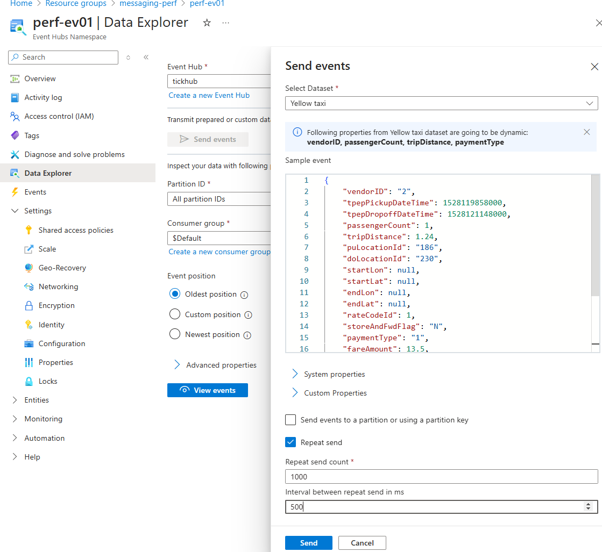
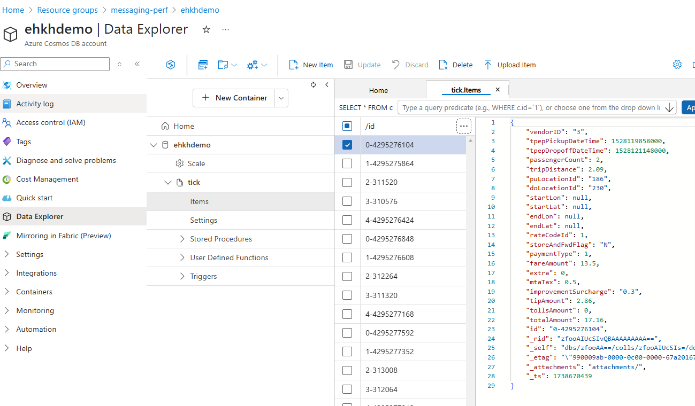

# Reading JSON from Event Hub, and inserting data into CosmosDB

Example C# Event Hub consumer app, to simply read JSON data from EventHub partitions, and insert into CosmosDB as quickly as possible.

C# was selected, specifically `.NET Core SDK >=3.0` due to its C# 8.0 features, and SDK support for Eventhub and Cosmos performance.

This example is using the `EventProcessorClient` SDK to consume events from Event Hub,  this will read events from all partitions in a production scenario, automatically balancing the number of replicas to the number of Eventhub partitions, and handle all the partition leasing and check-pointing.

On the Cosmos side, .NET SDK V3 contains stream APIs that can receive and return data without serializing, each CosmosClient instance is thread-safe and performs efficient connection management and address caching when it operates in Direct mode.  Following [this](https://learn.microsoft.com/en-us/azure/cosmos-db/nosql/performance-tips-dotnet-sdk-v3?tabs=trace-net-core) guide


## Create environment

### Setup variables

Set environment variables

```
UniqueEnv=kh01
ProjectName=perfstream
location=northeurope
rgName=${UniqueEnv}-${ProjectName}
EventHubName=${UniqueEnv}-${ProjectName}
CosmosName=${UniqueEnv}-${ProjectName}
```

Create .env file for local development

```.env
echo "
EVENT_HUBS_NAMESPACE=${EventHubName}.servicebus.windows.net
EVENT_HUB_NAME=${ProjectName}
EVENT_HUB_CONSUMER_GROUP=${ProjectName}-client
STORAGE_ACCOUNT_NAME=${UniqueEnv}${ProjectName}
STORAGE_CONTAINER_NAME=${ProjectName}-ehprocessor
COSMOS_ENDPOINT=https://${CosmosName}.documents.azure.com:443/
COSMOS_DATABASE_ID=${ProjectName}
COSMOS_CONTAINER=${ProjectName}" >ehapp-dotnet/.env

source ehapp-dotnet/.env
```

### Create Resources

```
// Create EventHub, hub, and consumer group
// TODO: Manual right now

// Create Storage account (used for the EventProcessorClient)
az storage account create -g $rgName -n $STORAGE_ACCOUNT_NAME -l $location --sku Standard_LRS

// Create Cosmos / Database and Collection
// TODO: Manual right now

```
### Required Permission

As with all good architectures, use Managed Identity for Access control

Role Assignment : Event Hub
```
az role assignment create  --role "Azure Event Hubs Data Owner"  \
   --assignee $(az ad signed-in-user show --query id -o tsv)  \
   --scope $(az eventhubs namespace show -n $EventHubName -g $rgName --query id -o tsv)
```

Role Assignment : Storage Blob Data Owner
```
az role assignment create  --role "Storage Blob Data Owner"  \
   --assignee $(az ad signed-in-user show --query id -o tsv)  \
   --scope $(az storage account show  -g $rgName -n $STORAGE_ACCOUNT_NAME --query id -o tsv)
```

Cosmos Roles [here](https://learn.microsoft.com/en-us/azure/cosmos-db/nosql/security/how-to-grant-data-plane-role-based-access?tabs=built-in-definition%2Ccsharp&pivots=azure-interface-cli#prepare-role-definition)

```
az cosmosdb sql role definition list -a ehkhdemo -g messaging-perf 
// "Cosmos DB Built-in Data Contributor"
az cosmosdb sql role assignment create  -a ehkhdemo -g messaging-perf \
    --role-definition-id $(az cosmosdb sql role definition list -a ehkhdemo -g messaging-perf --query "[1].id" -o tsv) \
    --principal-id $(az ad signed-in-user show --query id -o tsv) \
    --scope $(az cosmosdb sql role definition list -a ehkhdemo -g messaging-perf --query "[1].assignableScopes" -o tsv)

az role assignment create  \
    --role "DocumentDB Account Contributor" \
    --assignee $(az ad signed-in-user show --query id -o tsv) \
    --scope $(az cosmosdb sql role definition list -a ehkhdemo -g messaging-perf --query "[1].assignableScopes" -o tsv)
```

### Now run the app

```
dotnet build
dotnet run --project ./ehapp-dotnet
```

You can use the Eventhub `Data Explorer` in `portal.azure.com` to generated messages for testing purposes.



You can see the data appear in CosmosDB, using the cosmos `Data Explorer`

